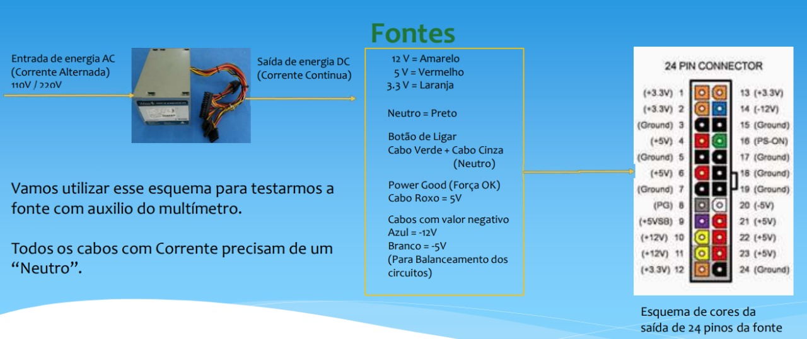

# Fontes

*PSU - **Power Supply Unit***

Responsável por transformar **energia alternada** com tensão de ``110V ~ 220V`` para **energia contínua**, com tensões de `3.3V / 5V / 12V` entre outras

> A fonte trabalha como um filtro de energia para adequar tensão aos componentes a serem alimentados

<em> Há as fontes genéricas, que não possuem comprovações e certificações de real eficiância com o que condiz com a descrição do produto</em>

---

## Como escolher uma boa fonte?

É importante saber qual as reais diferenças das fontes, tendo em vista para escolher uma que adeque os uso domestico de **baixo** ou **alto desempenho**, ou **uso empresarial**.

> Existem dois tipos de fontes e entre eles vários tipos de fonte, são eles "`Fontes Nominais`" e "`Fontes Reais`"

---

### - Fonte Nominal

  Comum nos Computadore Desktop Populares

  Baixo custo, comparado as fontes reais

  Desempenho mais baixo

Esse nome é devio a terem um nome que nos induz a pensa que elas tem uma capacidade maior do que realmente tem

Exemplo:

> Fonte ATX  
> Modelo W5 500 P425
> 
> Indicação da saída máxima da fonte 220W.

Computadores com fonte nominal tem um desempenho inferior no quese trata de eficiência energética

Esse tipo de fonte funciona porem nem todos os computadores pode utilizar devido a necessidade energética ds componentes

### - Fonte Real

Utilizada quando exite uma necessidade maior por parte do equipamento

Observando a evolução dos computadore, essa deveria ser a fonte padrão de todos os computadores de hoje em dia

- Fontes genéricas

- Fontes com certificados

Exemplo de selo:

``80 Plus``

É um selo que certifica que a fonte em uso total, garante eficiencia de 80% mais da energia "consumida" da tomada

---

## Eficiência Energética

É necessário sabermos que **toda fonte** terá uma perda de energia, e o que irá mudar dentre os modelos e marcas, é o aproveitamento de energia cada fonte 

Exemplo:

> Tendo uma fonte de `500W` com eficiência energética de `90%`. Ela será, teoricamente capaz de fornecer no máximo `450W` para o computador.

Nem sempre uma fonte com muita potência, significa mais uma qualidade energética maior

Exemplo:

> uma fonte de `500W` com eficiência energética de `80%` pode chegar a `400W` máximo  uma fonte de `750W` com eficiência de `50%` pode chegar a `375W` máximo

### Certificações 80 Plus com Potencia / Eficiencia

> | Pontecia Usada | Em 20% |
> | --- | --- | 
> | 80 Plus | 80% |
> | 80 Plus Bronze | 82% |
> | 80 Plus Silver | 85% |
> | 80 Plus Gold | 87% |
> | 80 Plus Platinum | 90% |

> | Pontecia Usada | Em 50% |
> | --- | --- | 
> | 80 Plus | 80% |
> | 80 Plus Bronze | 85% |
> | 80 Plus Silver | 88% |
> | 80 Plus Gold | 90% |
> | 80 Plus Platinum | 92% |

> | Pontecia Usada | Em 100% |
> | --- | --- | 
> | 80 Plus | 80% |
> | 80 Plus Bronze | 82% |
> | 80 Plus Silver | 85% |
> | 80 Plus Gold | 87% |
> | 80 Plus Platinum | 89% |

---

## PFC Ativo

*Muitas Fontes hoje em dia possuem a configuração de PFC-Ativo, mas o que é na prática esta caracteristica?*

Pela sigla `PFC` (`Power Factor Corretion`) significa Fator de Correção de Forma, em tradução livre, é uma especificação das fontes de energia que começaram a aparecer no mercado em 2005 e que busca melhorar a `eficiência da fonte` ao reduzir a perda de energia e, por consequência, o super aquecimento. A função é tão comum e necessária nas fontes de hoje que em alguns lugares é proibida a venda de fontes sem tecnologia PFC.

Embora ter PFC seja praticamente um regra para as fontes de energia, o PFC pode ser `ativo` ou `passivo` e isso reflete diretamente em um aproveitamento maior da energia que chega até a fonte para ser direcionada aos aparelhos. 

---

### Diferença entre PFC Ativo e Passivo

As fontes com PFC passivo possuem funcionalidades `mais simples` e são equipadas com **capacitores** e **indutores** adicionais que conseguem elevar o fator de potência da fonte em patamares entre `70%` e `80%`, o que significa que entre `20%` e `30%` da energia que chega até a fonte não é aproveitada e dissipa-se através do calor. As fontes passivas são usadas em **dispositivos menores** e **mais simples**, como `carregadores de celular`. 

O PFC ativo é um `circuito mais complexo`, formado por partes **eletrônicas** e **circuitos integrados** que aumentam consideravelmente a potência e praticamente não oferecem perda de energia. As fontes com PFC ativo dissipam em calor algo entre `1%` a `5%` da energia que a fonte recebe, sendo o principal tipo de fonte usada para computadores de mesa. 